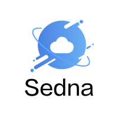

## What is Sedna?

Sedna is an edge-cloud synergy AI project incubated in KubeEdge SIG AI. Benefiting from the edge-cloud synergy capabilities provided by KubeEdge, Sedna can implement across edge-cloud collaborative training and collaborative inference capabilities, such as joint inference, incremental learning, federated learning, and lifelong learning. Sedna supports popular AI frameworks, such as TensorFlow, Pytorch, PaddlePaddle, MindSpore.

Sedna can simply enable edge-cloud synergy capabilities to existing training and inference scripts, bringing the benefits of reducing costs, improving model performance, and protecting data privacy.

## Features

Sedna has the following features：

* Provide the edge-cloud synergy AI framework.
    * Provide dataset and model management across edge-cloud, helping developers quickly implement synergy AI applications.

* Provide edge-cloud synergy training and inference frameworks.
    * Joint inference: under the condition of limited resources on the edge, difficult inference tasks are offloaded to the cloud to improve the overall performance, keeping the throughput.
    * Incremental training: For small samples and non-iid data on the edge, models can be adaptively optimized over time on the cloud or edge.
    * Federated learning: For those scenarios that the data being too large, or unwilling to migrate raw data to the cloud, or high privacy protection requirements, models are trained at the edge and parameters are aggregated on the cloud to resolve data silos effectively.
    * Lifelong learning: Confronted with the challenge of heterogeneous data distributions in complex scenarios and small samples on the edge, the edge-cloud synergy lifelong learning:
        * leverages the cloud knowledge base which empowers the scheme with memory ability, which helps to continuously learn and accumulate historical knowledge to overcome the catastrophic forgetting challenge.
        * is essentially the combination of another two learning schemes, i.e., multi-task learning and incremental learning, so that it can learn unseen tasks with shared knowledge among various scenarios over time.
    * etc..

* Compatibility
    * Compatible with mainstream AI frameworks such as TensorFlow, Pytorch, PaddlePaddle, and MindSpore.
    * Provides extended interfaces for developers to quickly integrate third-party algorithms, and some necessary algorithms for edge-cloud synergy have been preset, such as hard sample discovering, aggregation algorithm.

### Examples
Example1：[Using Joint Inference Service in Helmet Detection Scenario](https://github.com/kubeedge/sedna/tree/main/examples/federated_learning/surface_defect_detection#readme).  
Example2：[Using Incremental Learning Job in Helmet Detection Scenario](https://github.com/kubeedge/sedna/tree/main/examples/incremental_learning/helmet_detection#readme).  
Example3：[Using Federated Learning Job in Surface Defect Detection Scenario](https://github.com/kubeedge/sedna/tree/main/examples/joint_inference/helmet_detection_inference#readme).  
Example4：[Using Lifelong Learning Job in Thermal Comfort Prediction Scenario](https://github.com/kubeedge/sedna/tree/main/examples/lifelong_learning/atcii#readme).

In this scenario you will learn how to:

- Install Sedna onto Kubernetes.
